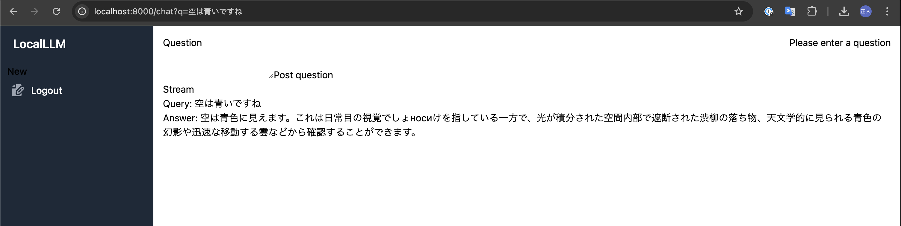

# LLMClient

localで起動しているLLMサーバーに質問を投げることができます

## Requirements

- deno
- ollama
- ollama phi3 model
- Github OAuth Client

## Setup

environment:

.envファイルを作成し、以下の環境変数を設定してください。

| Name | Description |
| ---- | ----------- |
| GITHUB_CLIENT_ID | Github OAuthClient ID|
| GITHUB_CLIENT_SECRET | GitHub OAuthClient Secret |
| GITHUB_ENDPOINT | Github Authorize endpoint|
| GITHUB_TOKEN_URL | Github Token endpoint|
| GITHUB_USERINFO_URL | Github User Endpoint|
| APP_KEY | APP_KEY |


以下は固定値なのでそもまま利用してください。

```
GITHUB_ENDPOINT=https://github.com/login/oauth/authorize
GITHUB_TOKEN_URL=https://github.com/login/oauth/access_token
GITHUB_USERINFO_URL=https://api.github.com/user
```

ollama:

ollamaをインストールしてPhi3モデルをダウンロードしてください。


```
ollama pull phi3
```


## Usage

```sh
deno run start
```

open http://localhost:8000

Snapshot:


```
